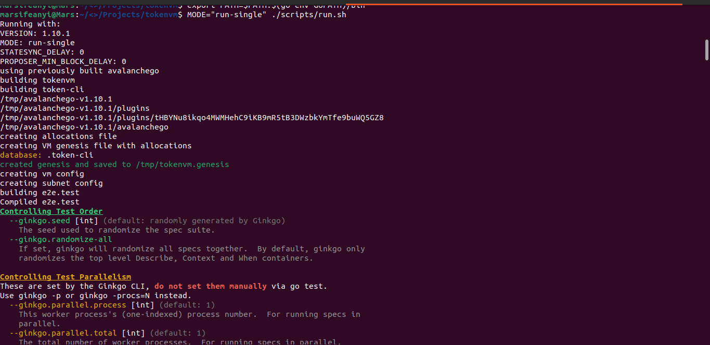
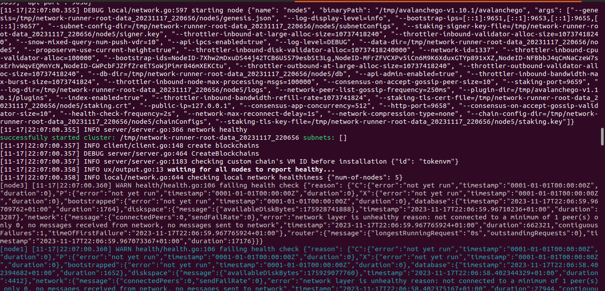
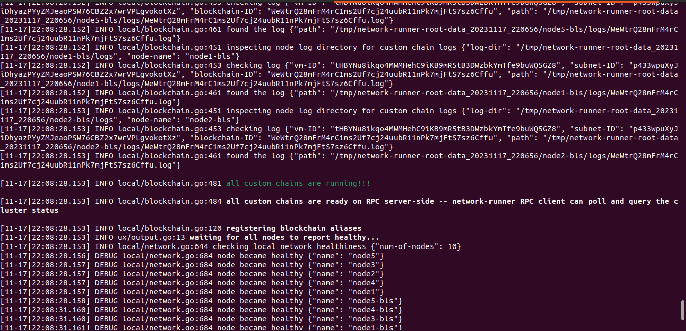
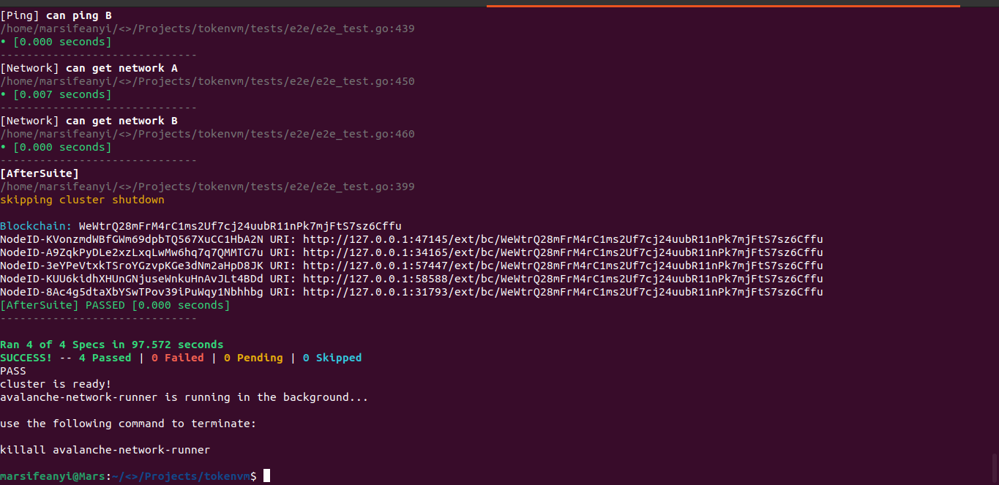
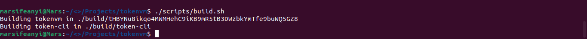
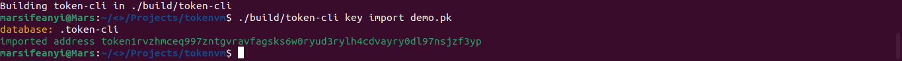
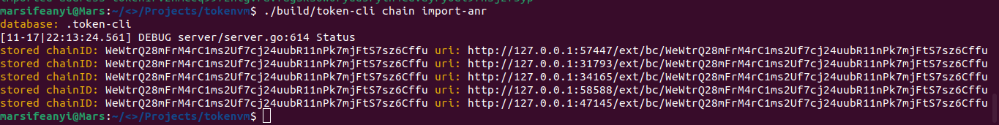
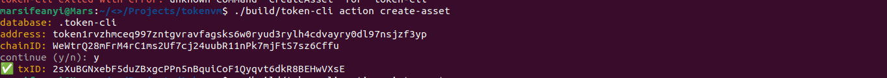
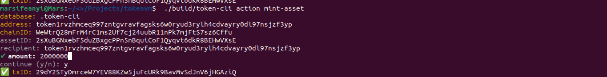
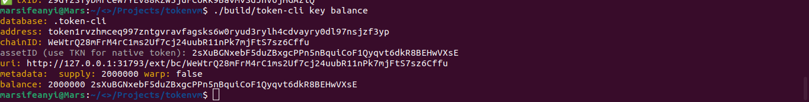

# Tokenvm Subnet using the Avalanche HyperSDK

The `tokenvm` using the [Avalanche HyperSDK](https://medium.com/avalancheavax/introducing-hypersdk-a-foundation-for-the-fastest-blockchains-of-the-future-a6b1609a6862) allows anyone create any asset, mint more of their asset, modify the metadata of their asset (if they reveal some info), and burn their asset. Additionally, there is an embedded on-chain exchange that allows anyone to create orders and fill (partial) orders of anyone else. To make this example easy to play with, the tokenvm also bundles a powerful CLI tool and serves RPC requests for trades out of an in-memory order book it maintains by syncing blocks.

## Table of Contents

- [Tokenvm Subnet using the Avalanche HyperSDK](#tokenvm-subnet-using-the-avalanche-hypersdk)
  - [Table of Contents](#table-of-contents)
    - [Completing the consts.go](#completing-the-constsgo)
    - [Registering the Missing Actions](#registering-the-missing-actions)
    - [Successfully Setup my subnet](#successfully-setup-my-subnet)
  - [Interacting with the Subnet](#interacting-with-the-subnet)
    - [Creating Asset](#creating-asset)
    - [Minting Tokens](#minting-tokens)
    - [Checking Balance](#checking-balance)
  - [Demo Videos](#demo-videos)
  - [Credit](#credit)
  - [Author](#author)
  - [Disclaimer](#disclaimer)

### Completing the consts.go

`consts/consts.go`

```go
const (
	// TODO: choose a human-readable part for your hyperchain
	HRP = "MarsEnergy-Chains"
	// TODO: choose a name for your hyperchain
	Name = "Mars Energy"
	// TODO: choose a token symbol
	Symbol = "MARSE"
)

```

```go
package consts

import (
	"github.com/ava-labs/avalanchego/ids"
	"github.com/ava-labs/avalanchego/vms/platformvm/warp"
	"github.com/ava-labs/hypersdk/chain"
	"github.com/ava-labs/hypersdk/codec"
	"github.com/ava-labs/hypersdk/consts"
)

const (
	// TODO: choose a human-readable part for your hyperchain
	HRP = "MarsEnergy-Chains"
	// TODO: choose a name for your hyperchain
	Name = "Mars Energy"
	// TODO: choose a token symbol
	Symbol = "MARSE"
)

var ID ids.ID

func init() {
	b := make([]byte, consts.IDLen)
	copy(b, []byte(Name))
	vmID, err := ids.ToID(b)
	if err != nil {
		panic(err)
	}
	ID = vmID
}
var (
	ActionRegistry *codec.TypeParser[chain.Action, *warp.Message, bool]
	AuthRegistry   *codec.TypeParser[chain.Auth, *warp.Message, bool]
)

```

### Registering the Missing Actions

`registry/registry.go`

```go
// TODO: register action: actions.CreateAsset
consts.ActionRegistry.Register(&actions.CreateAsset{}, actions.UnmarshalCreateAsset, false),

// TODO: register action: actions.MintAsset
consts.ActionRegistry.Register(&actions.MintAsset{}, actions.UnmarshalMintAsset, false),
```

```go
package registry

import (
	"github.com/ava-labs/avalanchego/utils/wrappers"
	"github.com/ava-labs/avalanchego/vms/platformvm/warp"
	"github.com/ava-labs/hypersdk/chain"
	"github.com/ava-labs/hypersdk/codec"

	"tokenvm/actions"
	"tokenvm/auth"
	"tokenvm/consts"
)

// Setup types
func init() {
	consts.ActionRegistry = codec.NewTypeParser[chain.Action, *warp.Message]()
	consts.AuthRegistry = codec.NewTypeParser[chain.Auth, *warp.Message]()

	errs := &wrappers.Errs{}
	errs.Add(
		// When registering new actions, ALWAYS make sure to append at the end.
		consts.ActionRegistry.Register(&actions.Transfer{}, actions.UnmarshalTransfer, false),


		// TODO: register action: actions.CreateAsset
		consts.ActionRegistry.Register(&actions.CreateAsset{}, actions.UnmarshalCreateAsset, false),

		// TODO: register action: actions.MintAsset
		consts.ActionRegistry.Register(&actions.MintAsset{}, actions.UnmarshalMintAsset, false),


		consts.ActionRegistry.Register(&actions.BurnAsset{}, actions.UnmarshalBurnAsset, false),
		consts.ActionRegistry.Register(&actions.ModifyAsset{}, actions.UnmarshalModifyAsset, false),

		consts.ActionRegistry.Register(&actions.CreateOrder{}, actions.UnmarshalCreateOrder, false),
		consts.ActionRegistry.Register(&actions.FillOrder{}, actions.UnmarshalFillOrder, false),
		consts.ActionRegistry.Register(&actions.CloseOrder{}, actions.UnmarshalCloseOrder, false),

		consts.ActionRegistry.Register(&actions.ImportAsset{}, actions.UnmarshalImportAsset, true),
		consts.ActionRegistry.Register(&actions.ExportAsset{}, actions.UnmarshalExportAsset, false),

		// When registering new auth, ALWAYS make sure to append at the end.
		consts.AuthRegistry.Register(&auth.ED25519{}, auth.UnmarshalED25519, false),
	)
	if errs.Errored() {
		panic(errs.Err)
	}
}
```

### Successfully Setup my subnet

- Step 1

```bash
MODE="run-single" ./scripts/run.sh
```









- Step 2

```bash
./scripts/build.sh
```



- Step 3

```bash
./build/token-cli key import demo.pk
```



- Step 4

```bash
./build/token-cli chain import-anr
```



## Interacting with the Subnet

### Creating Asset

```bash
./build/token-cli action create-asset
```



### Minting Tokens

```bash
./build/token-cli action mint-asset
```



### Checking Balance

```bash
./build/token-cli key balance
```



## Demo Videos

https://www.loom.com/share/74c93526867c4039881946cad1a907e4?sid=99aa3f8e-b2bd-46c5-ad1a-ec45735ab553

## Credit

[Metacrafters/tokenvm](https://github.com/Metacrafters/tokenvm)

[Avalanche Labs](https://github.com/ava-labs/hypersdk)

## Author

Marcellus Ifeanyi
[@metacraftersio](https://twitter.com/Mars_Energy)

## Disclaimer

- This smart contract is provided under the MIT license, and users are encouraged to review and understand the code before interacting with it.
